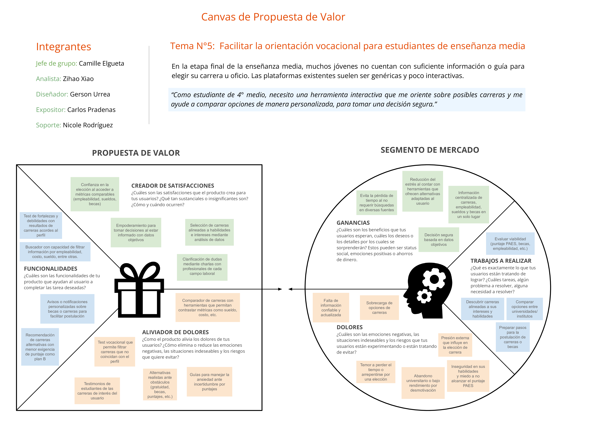
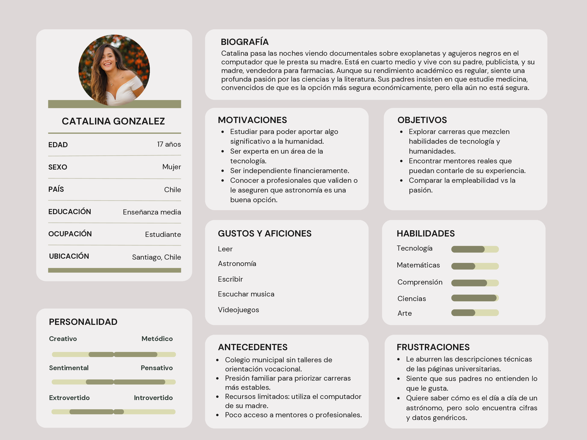
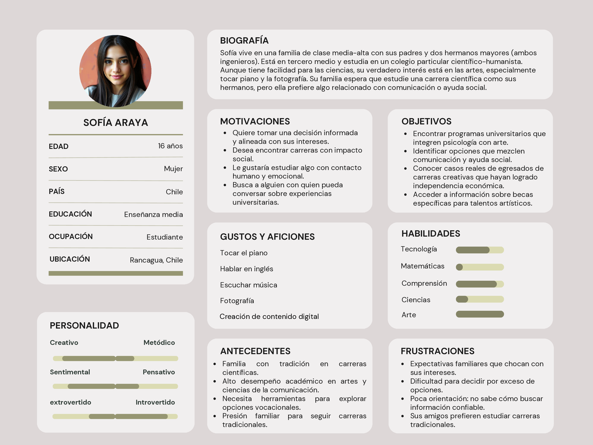
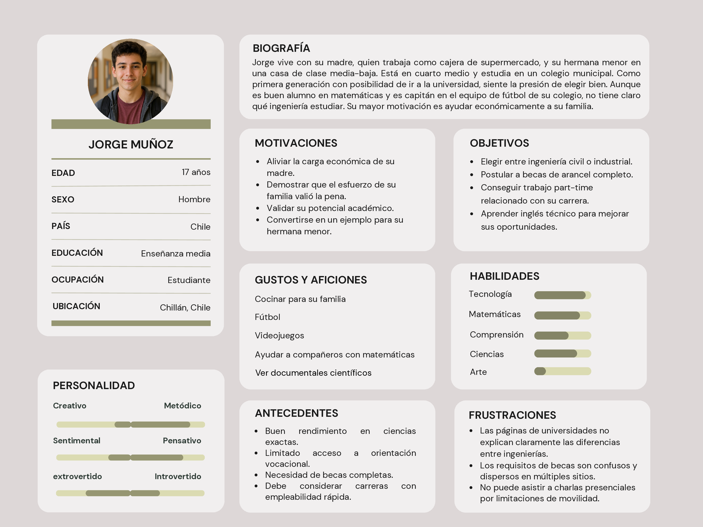
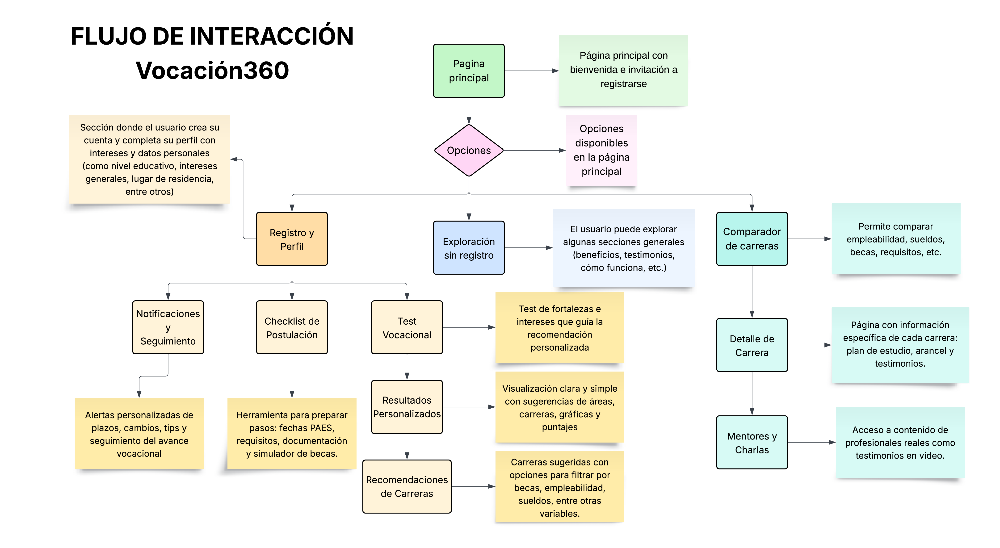
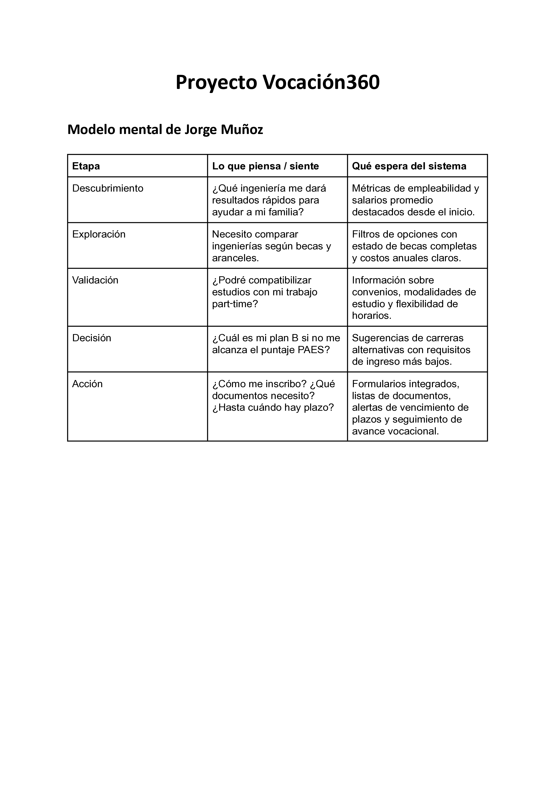
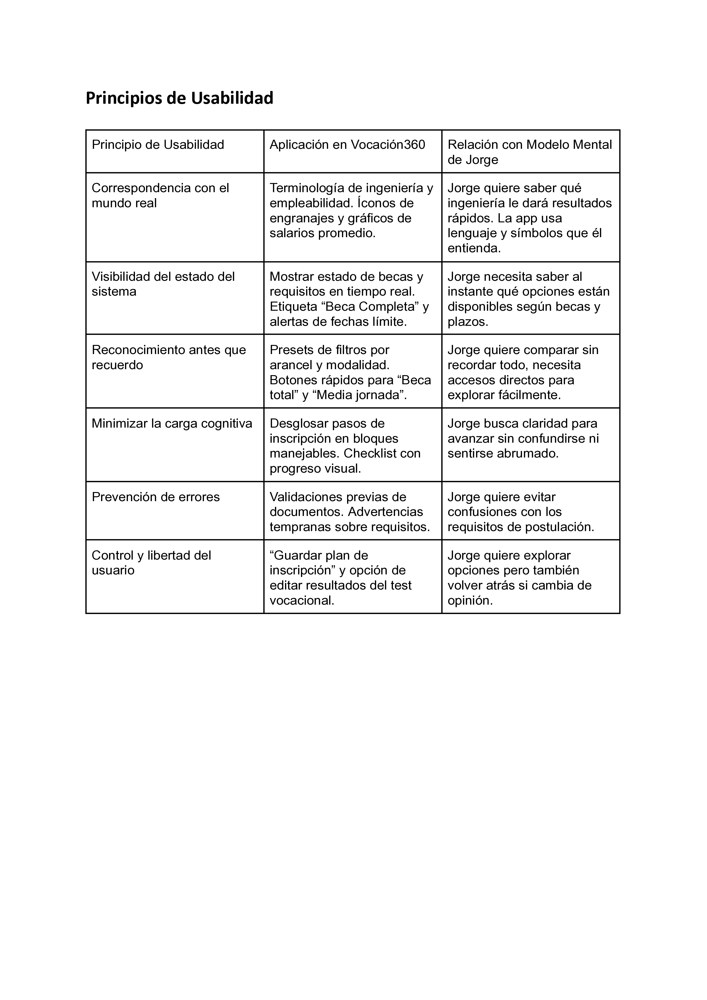

# Vocación360 UXD
User Experience Design for Vocación360: A Vocational Guidance Platform for High School Students in Chile

## Index

- [1. Introduction](#1-introduction)
- [2. Team & Roles](#2-team--roles)
- [3. Strategy](#3-strategy)
   - [3.1. Value Proposition Canvas](#31-value-proposition-canvas)
- [4. Scope](#4-scope)
   - [4.1. UX Personas](#41-ux-personas)
   - [4.2. Benchmarking](#42-benchmarking)
- [5. Structure](#5-structure)
   - [5.1. User Mental Model](#51-user-mental-model)
   - [5.2. Navigation Flow](#52-navigation-flow)
- [6. Skeleton](#6-skeleton)
   - [6.1. Customer Journey Map](#61-customer-journey-map)
   - [6.2. Low-Fi Wireframes](#62-low-fi-wireframes)
- [7. Surface](#7-surface)
   - [7.1. Interface Evolution](#71-interface-evolution)
   - [7.2. High Definition Interfaces](#72-high-definition-interfaces)

---

## 1. Introduction

High school students in Chile face significant challenges when choosing their academic and professional paths. Existing vocational guidance platforms offer fragmented information across multiple websites, with overwhelming interfaces and technical language that creates unnecessary barriers.

Vocación360 addresses these issues by providing a comprehensive, user-friendly application designed specifically for students making career decisions. Our platform centralizes three essential tools: personalized vocational tests, clear career information with comparison capabilities, and organized scholarship resources—all within an intuitive interface that simplifies the decision-making process.

Through careful application of UX design principles and student-centered research, we've created a solution that transforms what is typically an anxiety-producing experience into a manageable journey of self-discovery and informed choice.

---

## 2. Team & Roles

Camille Elgueta - Project Manager

Zihao Xiao - Analist

Gerson Urrea - Designer

Carlos Pradenas - Expositor

---

## 3. Strategy

### 3.1. Value Proposition Canvas

The first step taken by the team was to define the strategy through a "Value Proposition Canvas," used to align the user needs with the proposed solution. This process allowed us to clearly identify our target market—high school students facing challenges in choosing their future undergraduate program and develop a product tailored to their realities. 

From the canvas, we observed key alignments such as the "fear of making the wrong choice" and the corresponding feature "comparison tools with objective data." This connection helped us understand how to support users through clarity and personalization. Other early ideas, like integrating external advising networks, were discussed but ultimately not prioritized in the current version. 

This strategic process helped ensure the solution is not only functional but directly addresses the students' pains, gains, and real decision-making contexts.

---

## 4. Scope

### 4.1. UX Personas

The application is designed for high school students who are exploring their future undergraduate programs and need support in making informed decisions. It is suitable for students with clear interests as well as those who are still uncertain. It provides step-by-step guidance through vocational tests, undergraduate program exploration tools, and scholarship information. 

It allows users to reflect on their strengths, compare study options, and access relevant, real-world data. It also considers different user contexts and motivations, ensuring the experience feels personal and supportive. In short, it is a versatile application that helps students navigate their academic choices with clarity and confidence.

Below are our three user personas, representing different types of students with diverse needs and circumstances:

### 4.2. Benchmarking

In order to develop an application that truly responds to the needs and expectations of high school students seeking vocational guidance, it was essential to conduct a thorough benchmarking analysis of existing platforms in the educational field. This process allowed us to evaluate the strengths and weaknesses of competing applications, such as Mifuturo, EligeCarrera, CarrerasUniversitarias, and BeneficiosEstudiantiles, identifying both useful features and areas for improvement.

Through this analysis, we recognized valuable elements to include in our product—such as scholarship search tools, personalized filters based on user profiles, and centralized access to undergraduate program and scholarship information. At the same time, we identified key pain points in existing platforms, such as unclear test results, excessive visual noise, and non-functional buttons, which we aim to eliminate from our own design.

By leveraging these insights, we are building an application that not only avoids the common pitfalls of existing tools but also enhances the user experience through features like undergraduate program comparisons, personalized recommendations, and notifications based on individual profiles. Benchmarking has therefore played a critical role in aligning our solution with both market standards and user-centered design principles, ensuring that Vocación360 delivers a clear, relevant, and empowering path toward informed academic decision-making.

---

## 5. Structure

### 5.1. User Mental Model

The User Mental Model helps us understand how our target users (Jorge, Catalina, and Sofía) conceptualize the vocational guidance process and expect our application to function. This insight allows us to design interfaces that match their expectations and cognitive patterns.

### 5.2. Navigation Flow

The Vocación360 sitemap presents a simplified, user-focused structure designed to support high school seniors in making informed academic decisions. Key sections include Vocational Tests (interests, skills, strengths, and results), Explore Careers (with filters by study area, interests, and skills, as well as career comparison tools and detailed views), and Scholarships and Benefits (scholarship search and important dates). Additional areas include Help & FAQ and About Us. A key improvement was removing login and registration, enabling full access without creating an account, which enhances accessibility and reduces barriers for students.

---

## 6. Skeleton

### 6.1. Customer Journey Map

**TO-DO:** 

### 6.2. Low-Fi Wireframes

**TO-DO:** 

---

## 7. Surface

### 7.1. Interface Evolution

**TO-DO:** 

### 7.2. High Definition Interfaces

**TO-DO:**

---
