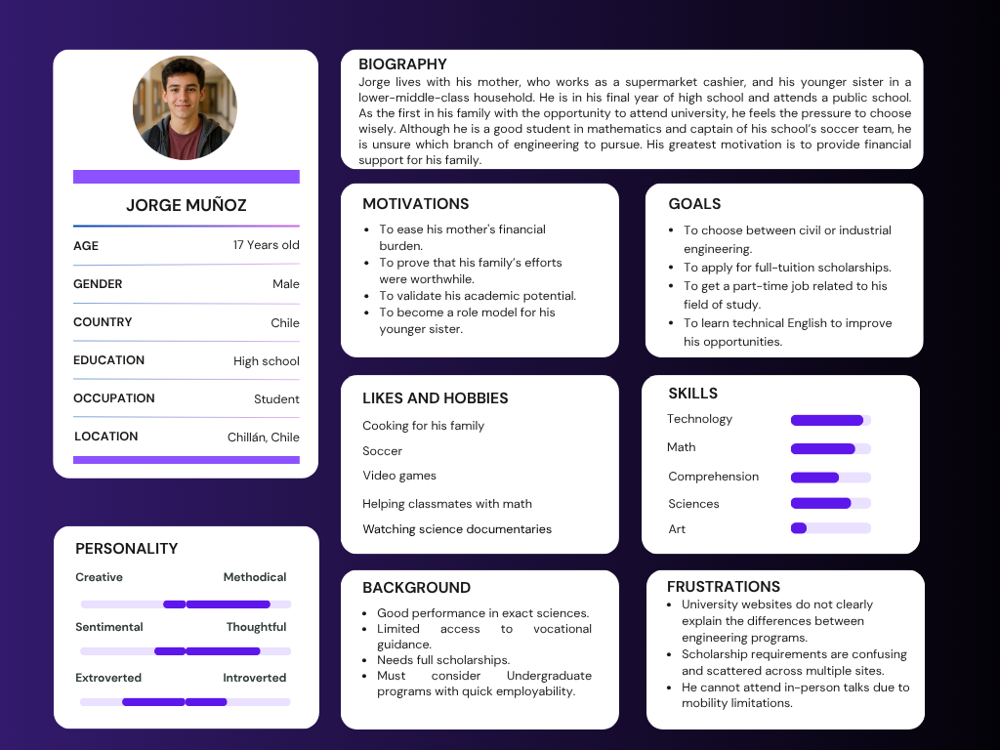
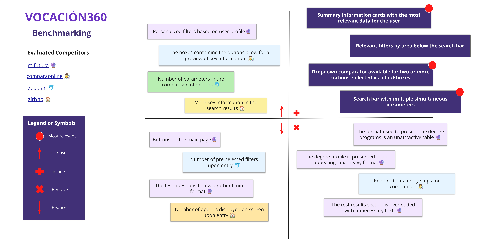

# Vocación360 UXD
User Experience Design for Vocación360: A Vocational Guidance Platform for High School Students in Chile

## Index

- [1. Introduction](#1-introduction)
- [2. Team & Roles](#2-team--roles)
- [3. Strategy](#3-strategy)
  - [3.1. Value Proposition Canvas](#31-value-proposition-canvas)
  - [3.2. UX Personas](#32-ux-personas)
  - [3.3. Benchmarking](#33-benchmarking)
- [4. Scope](#4-scope)
  - [4.1 Customer Journey Map](#41-customer-journey-map)
- [5. Structure](#5-structure)
  - [5.1. Navigation Flow](#51-navigation-flow)
- [6. Skeleton](#6-skeleton)
  - [6.1. Low-Fi Wireframes](#62-low-fi-wireframes)
- [7. Surface](#7-surface)
  - [7.1. Interface Evolution](#71-interface-evolution)
  - [7.2. High Definition Interfaces](#72-high-definition-interfaces)

---

## 1. Introduction

High school students in Chile face significant challenges when choosing their academic and professional paths. Existing vocational guidance platforms offer fragmented information across multiple websites, with overwhelming interfaces and technical language that creates unnecessary barriers.

Vocación360 addresses these issues by providing a comprehensive, user-friendly application designed specifically for students making career decisions. Our platform centralizes three essential tools: personalized vocational tests, clear career information with comparison capabilities, and organized scholarship resources—all within an intuitive interface that simplifies the decision-making process.

Through careful application of UX design principles and student-centered research, we've created a solution that transforms what is typically an anxiety-producing experience into a manageable journey of self-discovery and informed choice.

---

## 2. Team & Roles

Camille Elgueta - Project Manager

Zihao Xiao - Analyst

Gerson Urrea - Designer

Carlos Pradenas - Presenter

---

## 3. Strategy

### 3.1. Value Proposition Canvas

In a [survey](https://docs.google.com/spreadsheets/d/18C8Lrk0pwEsjByS-7obqHJb23tWlxP_VGB2JUes502Y/edit?usp=sharing) conducted with 40 students at Escuela Amanecer, **52.5%** stated that external opinions directly influence their vocational decisions, and **75%** said they are not aware of any online tools for career guidance. Platforms like *MiFuturo* or Ministry of Education websites were not mentioned, revealing a lack of access to key information and a **strategic opportunity**.

We used the **Value Proposition Canvas** to align these needs with our proposed solution. In response to insecurity about their abilities and social pressure, we aim to **empower students** through tests that assess strengths, interests, and skills, along with objective data on salaries and employability to challenge myths passed on by their social circles.

Students' main fear is not just making the wrong choice, but **having no choice at all** due to low PAES scores. Therefore, the solution must go beyond functionality and directly address their real pains and needs. **Vocación360** is an all-in-one platform that provides free access to scholarship information, vocational tests, career data, and university comparison tools, including metrics like employability, average salary, and accreditation. It does not require registration, and results are downloaded locally so students can keep their personal journey.

### 3.2. UX Personas

The application is designed for high school students who are exploring their future undergraduate programs and need support in making informed decisions. It is suitable for students with clear interests as well as those who are still uncertain. It provides step-by-step guidance through vocational tests, undergraduate program exploration tools, and scholarship information. 

It allows users to reflect on their strengths, compare study options, and access relevant, real-world data. It also considers different user contexts and motivations, ensuring the experience feels personal and supportive. In short, it is a versatile application that helps students navigate their academic choices with clarity and confidence.

Below are our three user personas, representing different types of students with diverse needs and circumstances:

### 3.3. Benchmarking 

In order to develop an application that truly responds to the needs and expectations of high school students seeking vocational guidance, it was essential to conduct a thorough benchmarking analysis of existing platforms in the educational field. This process allowed us to evaluate the strengths and weaknesses of competing applications, such as Mifuturo, EligeCarrera, CarrerasUniversitarias, and BeneficiosEstudiantiles, identifying both useful features and areas for improvement.

Through this analysis, we recognized valuable elements to include in our product—such as scholarship search tools, personalized filters based on user profiles, and centralized access to undergraduate program and scholarship information. At the same time, we identified key pain points in existing platforms, such as unclear test results, excessive visual noise, and non-functional buttons, which we aim to eliminate from our own design.

By leveraging these insights, we are building an application that not only avoids the common pitfalls of existing tools but also enhances the user experience through features like undergraduate program comparisons, personalized recommendations, and notifications based on individual profiles. Benchmarking has therefore played a critical role in aligning our solution with both market standards and user-centered design principles, ensuring that Vocación360 delivers a clear, relevant, and empowering path toward informed academic decision-making.

---

## 4. Scope

### 4.1. Customer Journey Map

The Customer Journey Map outlines the stages and interactions a user has with our product — from the moment they discover it to when they form their final opinion based on their experience.

Below are the key stages we identified:

🔍 Awareness
The user discovers the product, either through a recommendation, social media advertisement, or related searches. This is the first point of contact with the brand.

🤔 Consideration
After discovering it, the user evaluates whether to use the product, comparing it with similar services. At this stage, they may still be influenced by additional information, reviews, or recommendations.

✅ Decision
The user chooses to try the product and begins interacting with it. During this phase, they form impressions based on real usage, which will shape their final opinion.

💬 Loyalty & Advocacy
After completing their experience, the user forms a definitive opinion. This will influence whether they use the product again and whether they recommend it to others — potentially becoming a brand advocate.

---

## 5. Structure

### 5.1. Navigation Flow

The Vocación360 sitemap presents a simplified, user-focused structure designed to support high school seniors in making informed academic decisions. Key sections include Vocational Tests (interests, skills, strengths, and results), Explore undergraduate programs (with filters by study area, interests, and skills, as well as undergraduate program comparison tools and detailed views), and Scholarships and Benefits (scholarship search and important dates). Additional areas include Help & FAQ and About Us. A key improvement was removing login and registration, enabling full access without creating an account, which enhances accessibility and reduces barriers for students.

---

## 6. Skeleton

### 6.1. Low-Fi Wireframes

The wireframes developed represent an approximation of the structure and design of the interfaces associated with the committed functionalities. The main navigation between screens is carried out through a top navigation bar, which is present across all system interfaces.

In general terms, the interfaces can be grouped into three main thematic categories:

🧭 Interfaces Related to Academic Programs
These interfaces prioritize the use of tables to display structured and repetitive information, such as the characteristics and attributes of academic programs. Additionally, pie charts are used to present contextual information related to the composition of students enrolled in a program, as well as the academic weighting requirements needed to apply.

📝 Interfaces Related to Tests
These interfaces follow a minimalist and straightforward design, centered around Likert-scale questions that allow users to express degrees of agreement or disagreement. The test results are presented using pie charts that show the user's affinity with different areas of knowledge, along with a concise description and clear recommendations. The goal is to ensure that users can easily understand the results through precise and actionable information.

🎓 Interfaces Related to Student Benefits
The information is organized into three main sections. In each section, the benefits available to users are presented with a brief description and links to official platforms. A filter bar is included to allow students to explore the available benefits based on their interests. The main objective is for users to clearly identify what benefits they can access, their type, and where to go for more information.

You can view all low-fidelity wireframes in the following PDF document:  
📄 [Wireframes – Vocación360 (PDF)](docs/wireframes-vocacion360.pdf)

---

## 7. Surface

### 7.1. Interface Evolution

## Interface Evolution Process: Explanations and Key Reasons for Modifications

In the initial versions of the interface, we included a top navigation bar with the following options: Home, Undergraduate Programs, Benefits, Points of Interest, About Us, and Login/Register. However, as we refined the project's scope, we decided to remove "Points of Interest" and temporarily disregard the Login/Register functionality. This was because user login would only provide access to test history—something that can be easily replaced by allowing local downloads of results. Nonetheless, we do not rule out including this feature in future versions.

Our second consideration was the target audience: high school students seeking vocational guidance. These young users are often confused or overwhelmed, and requesting them to create an account or enter personal information at the outset might discourage them from engaging further. To avoid early abandonment of the platform, we chose to simplify access as much as possible.

Additionally, between the wireframes and the final prototype, we made adjustments to margins and spacing to better align with web design standards seen in similar informational websites. These changes improve readability and the overall browsing experience.

In our competitive benchmarking, we prioritized a cool color palette—meant to convey calmness and reflection—because we believe career decisions should be approached thoughtfully and without external pressure. We also introduced value-added tools compared to our competitors: the ability to compare careers and download test results for free, without requiring registration.

Finally, the survey conducted at a public high school revealed that most students didn't know where to find information about scholarships and financial aid. To support them at this critical stage, we created the "Benefits" section, which compiles scholarships from international, municipal, and private institutions. It includes filters by university, admission scores, and tuition fees, and provides direct links to each program's official site. This feature reflects our belief that financial factors play a key role in students' decisions to apply for a degree.

### 7.2. High Definition Interfaces

High-fidelity interfaces clearly showcase the project's visual style, content structure, and navigation flow. Additionally, animations and transitions are incorporated where appropriate, delivering a more realistic and immersive user experience.

**Key highlights:**

- A **cool color palette** was chosen to convey a sense of calm, trust, and clarity throughout the user’s navigation.
- Since certain elements are repeated across multiple screens, a set of **reusable components** was created to ensure visual consistency and simplify maintenance. These components include the filter bar, search bar, navigation bar, buttons, and more.
- **Component variants** were designed to reflect different **visual states**, especially for interactive elements. For instance, buttons change color on hover, clearly indicating their interactivity and encouraging user engagement.

You can view all high-fidelity interfaces in the following PDF document:  
📄 [Hi-Fi Interfaces – Vocación360 (PDF)](docs/hi-fi-interfaces-vocacion360.pdf)

---

## 8. Annex

This section provides direct access to all detailed PDF documents organized by project phase and section. Each document contains comprehensive information and visual materials supporting the design process.

### 3. Strategy Documents
- 📄 **[Value Proposition Canvas - Vocación360](docs/value-prop-canvas-vocacion360.pdf)**  
 Detailed analysis of user pains, gains, and our value proposition alignment
- 📄 **[UX Personas - Vocación360](docs/ux-personas-vocacion360.pdf)**  
 Complete user personas with detailed profiles, needs, and behaviors
- 📄 **[Benchmarking Analysis - Vocación360](docs/benchmarking-vocacion360.pdf)**  
 Comprehensive competitive analysis and market positioning

### 4. Scope Documents
- 📄 **[Customer Journey Map - Vocación360](docs/customer-journey-map-vocacion360.pdf)**  
 Detailed user journey mapping across all touchpoints and interactions

### 5. Structure Documents
- 📄 **[Sitemap - Vocación360](docs/sitemap-vocacion360.pdf)**  
 Complete information architecture and navigation structure

### 6. Skeleton Documents
- 📄 **[Low-Fi Wireframes - Vocación360](docs/wireframes-vocacion360.pdf)**  
 Complete set of low-fidelity wireframes for all main interfaces

### 7. Surface Documents
- 📄 **[Hi-Fi Interfaces - Vocación360](docs/hi-fi-interfaces-vocacion360.pdf)**  
 Final high-fidelity interface designs with visual style and interactions

---
