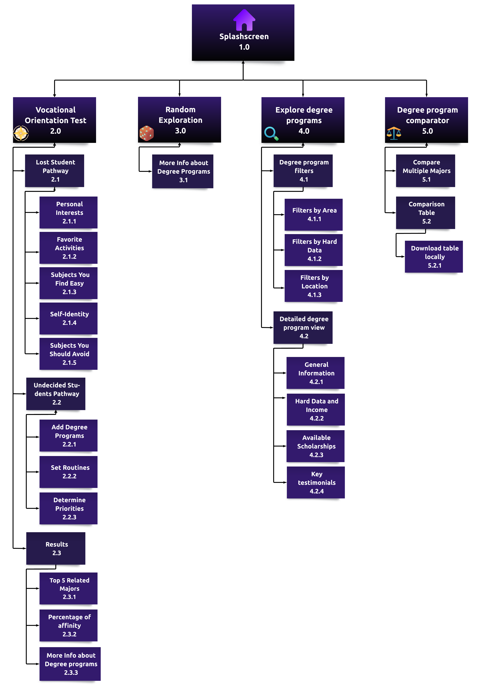

# Vocación360 UXD
User Experience Design for Vocación360: A Vocational Guidance Platform for High School Students in Chile

## Index

- [1. Introduction](#1-introduction)
- [2. Team & Roles](#2-team--roles)
- [3. Strategy](#3-strategy)
  - [3.1. Value Proposition Canvas](#31-value-proposition-canvas)
  - [3.2. UX Personas](#32-ux-personas)
  - [3.3. Benchmarking](#33-benchmarking)
- [4. Scope](#4-scope)
  - [4.1 Customer Journey Map](#41-customer-journey-map)
    - [4.1.1 Decision Stage Interfaces](#411-decision-stage-interfaces)
- [5. Structure](#5-structure)
  - [5.1. Navigation Flow](#51-navigation-flow)
- [6. Skeleton](#6-skeleton)
  - [6.1. Low-Fi Wireframes](#62-low-fi-wireframes)
- [7. Surface](#7-surface)
  - [7.1. Interface Evolution](#71-interface-evolution)
  - [7.2. High Definition Interfaces](#72-high-definition-interfaces)

---

## 1. Introduction

> *What if I’m just wasting my time?*
> *What if I disappoint my family with my decision?*
> *Will I earn enough to make a living?*

In a survey conducted with 40 students at Escuela Amanecer, **52.5%** stated that external opinions directly influence their vocational decisions, and **75%** said they are not aware of any online tools for academic program guidance. Platforms like *MiFuturo* or Ministry of Education websites were not mentioned, revealing a lack of access to key information and a **strategic opportunity**.

High school students in Chile face significant challenges when choosing their academic and professional paths. Existing vocational guidance platforms offer fragmented information across multiple websites, with overwhelming interfaces and technical language that creates unnecessary barriers.

Vocación360 offers a comprehensive and intuitive solution to support students in choosing their university degree program. Our platform brings together three key tools: vocational orientation tests, random exploration of degree programs, and access to clear, comparative, and up-to-date information on undergraduate degree programs.

Through careful application of UX design principles and student-centered research, we've created a solution that transforms what is typically an anxiety-producing experience into a manageable journey of self-discovery and informed choice.

---

## 2. Team & Roles

Camille Elgueta - Project Manager

Zihao Xiao - Analyst

Gerson Urrea - Designer

Carlos Pradenas - Presenter

---

## 3. Strategy

### 3.1. Value Proposition Canvas

We used the Value Proposition Canvas to align these needs with our solution. While our target audience is high school students, they represent very diverse realities: from those who already have some academic options in mind to those who feel completely lost about their future. There are also students who distrust vocational tests, lacking the motivation or patience to complete them.

**Vocación360** aims to tackle a complex issue from multiple dimensions: social, emotional, and technical. While there’s a clear market opportunity, there are also major challenges, given the absence of standout websites in this field. In response, our proposal is shaped around features carefully designed to foster trust and connection:

------

- **Striking aesthetic with a defined visual identity:**
   An appealing and functional design can be the difference between engaging and retaining a user—or losing them forever. Vocación360 embraces a modern, immersive aesthetic with a color palette of purples, oranges, and yellows, evoking depth, energy, and modernity.
- **Vocational guidance test adapted to different situations:**
   Designed for students who are unsure about their future, the test offers two distinct paths: one for those who feel completely lost, and another for those choosing between two options. The questions aim to provide realistic recommendations, considering both the subjects you’re good at and those you don’t enjoy. For example, *we won’t recommend civil engineering if you hate math!*
- **Gamified degree program exploration:**
   **Don’t like tests? Find them too long or unreliable but still want to explore new options? No problem!** Vocación360 includes a random exploration feature: by clicking on a die, you’ll see cards with different degree programs visually represented. You decide the pace and the direction.
   *Note: We’re not encouraging you to choose your future at random—but we do want to help you broaden your perspective and explore options you might have never considered.*
- **Personalized degree program explorer and comparator:**
   While several sites provide information about degree programs, Vocación360 stands out for its visual clarity and intuitive structure. It allows you to filter options by location, tuition cost, or average salary, using cards that summarize the most relevant information. It also includes a comparator that lets you analyze two or more degree programs side by side, visually highlighting the key differences.

📊 You can view the full survey responses [here](https://docs.google.com/spreadsheets/d/18C8Lrk0pwEsjByS-7obqHJb23tWlxP_VGB2JUes502Y/edit?usp=sharing).

### 3.2. UX Personas

The application is designed for high school students who are exploring their future undergraduate programs and need support in making informed decisions. It is suitable for students with clear interests as well as those who are still uncertain. It provides step-by-step guidance through vocational tests, undergraduate program exploration tools, and scholarship information. 

It allows users to reflect on their strengths, compare study options, and access relevant, real-world data. It also considers different user contexts and motivations, ensuring the experience feels personal and supportive. In short, it is a versatile application that helps students navigate their academic choices with clarity and confidence.

Below are our three user personas, representing different types of students with diverse needs and circumstances:

### 3.3. Benchmarking 

In order to develop an application that truly responds to the needs and expectations of high school students seeking vocational guidance, it was essential to conduct a thorough benchmarking analysis of existing platforms in the educational field. This process allowed us to evaluate the strengths and weaknesses of competing applications, such as Mifuturo, EligeCarrera, CarrerasUniversitarias, and BeneficiosEstudiantiles, identifying both useful features and areas for improvement.

Through this analysis, we recognized valuable elements to include in our product—such as scholarship search tools, personalized filters based on user profiles, and centralized access to undergraduate program and scholarship information. At the same time, we identified key pain points in existing platforms, such as unclear test results, excessive visual noise, and non-functional buttons, which we aim to eliminate from our own design.

By leveraging these insights, we are building an application that not only avoids the common pitfalls of existing tools but also enhances the user experience through features like undergraduate program comparisons, personalized recommendations, and notifications based on individual profiles. Benchmarking has therefore played a critical role in aligning our solution with both market standards and user-centered design principles, ensuring that Vocación360 delivers a clear, relevant, and empowering path toward informed academic decision-making.

---

## 4. Scope

### 4.1. Customer Journey Map

The Customer Journey Map outlines the stages and interactions a user has with our product — from the moment they discover it to when they form their final opinion based on their experience.

Below are the key stages we identified:

🔍 Awareness
The user discovers the product, either through a recommendation, social media advertisement, or related searches. This is the first point of contact with the brand.

🤔 Consideration
After discovering it, the user evaluates whether to use the product, comparing it with similar services. At this stage, they may still be influenced by additional information, reviews, or recommendations.

✅ Decision
The user chooses to try the product and begins interacting with it. During this phase, they form impressions based on real usage, which will shape their final opinion.

💬 Loyalty & Advocacy
After completing their experience, the user forms a definitive opinion. This will influence whether they use the product again and whether they recommend it to others — potentially becoming a brand advocate.

#### 4.1.1. Decision Stage Interfaces

**Customer Activities**

The user explores key features of Vocación360 — comparing degree programs, discovering scholarships and benefits, and taking diagnostic tests. A key interface here is the academic program comparison screen, which lets users generate a downloadable table comparing two programs and their universities.

**Customer Goals**

The user’s goal is to identify the academic path that aligns best with their interests and abilities. To support this, Vocación360 offers interest, strengths, and skills tests. These identify the user’s strongest areas and provide a list of recommended programs at the end of each test. The results can be downloaded locally.

**Touchpoints**

The website interface is the primary point of contact with high school students. The home screen plays a key role, with a background in cool tones designed to inspire reflection and convey calm for students who may feel lost, anxious, or overwhelmed by the need to explore their true vocation and make decisions about their future.

---

## 5. Structure

### 5.1. Navigation Flow

The Vocación360 sitemap presents a simplified, user-focused structure designed to support high school seniors in making informed academic decisions. Key sections include Vocational Tests (interests, skills, strengths, and results), Explore Undergraduate Programs (with filters by study area, interests, and skills, as well as undergraduate program comparison tools and detailed views), and Scholarships and Benefits (scholarship search and important dates). Additional areas include Help & FAQ and About Us. A key improvement was removing login and registration, enabling full access without creating an account — which enhances accessibility and reduces barriers for students.

---

## 6. Skeleton

### 6.1. Low-fidelity wireframes

The wireframes developed represent an approximation of the structure and design of the interfaces associated with the committed functionalities. The main navigation between screens is carried out through a top navigation bar, which is present across all system interfaces.

In general terms, the interfaces can be grouped into three main thematic categories:

🧭 Interfaces Related to degree programs
These interfaces prioritize the use of tables to display structured and repetitive information, such as the characteristics and attributes of degree programs. Additionally, pie charts are used to present contextual information related to the composition of students enrolled in a program, as well as the academic weighting requirements needed to apply.

📝 Interfaces Related to Tests
These interfaces follow a minimalist and straightforward design, centered around Likert-scale questions that allow users to express degrees of agreement or disagreement. The test results are presented using pie charts that show the user's affinity with different areas of knowledge, along with a concise description and clear recommendations. The goal is to ensure that users can easily understand the results through precise and actionable information.

🎓 Interfaces Related to Student Benefits
The information is organized into three main sections. In each section, the benefits available to users are presented with a brief description and links to official platforms. A filter bar is included to allow students to explore the available benefits based on their interests. The main objective is for users to clearly identify what benefits they can access, their type, and where to go for more information.

- 📁 **[Wireframes Workspace – Vocación360 (Figma)](https://www.figma.com/design/xzcIdIPWxBuT59i8s7O3t0/Wireframes-Vocación360?t=7C1t74Ojj2hCTtnC-1)**  
  Complete set of low-fidelity wireframes in the shared Figma workspace

- 📄 **[Low-Fi Wireframes – Vocación360 (PDF)](docs/wireframes-vocacion360.pdf)**  
  Complete set of low-fidelity wireframes for all main interfaces
---

## 7. Surface

### 7.1. Interface Evolution

## Interface Evolution Process: Explanations and Key Reasons for Modifications

In the initial versions of the interface, we included a top navigation bar with the following options: Home, Undergraduate Programs, Benefits, Points of Interest, About Us, and Login/Register. However, as we refined the project's scope, we decided to remove "Points of Interest" and temporarily disregard the Login/Register functionality. This was because user login would only provide access to test history—something that we replaced by allowing users to download their results for free, without requiring registration. Nonetheless, we do not rule out including this feature in future versions.

Our second consideration was the target audience: high school students seeking vocational guidance. These young users are often confused or overwhelmed, and requesting them to create an account or enter personal information at the outset might discourage them from engaging further, so we chose to simplify access as much as possible.

Additionally, between the wireframes and the final prototype, we made adjustments to margins and spacing to better align with web design standards seen in similar informational websites. These changes improve readability and the overall browsing experience.

In our competitive benchmarking, we prioritized a cool color palette aligned with thoughtful decision-making. We also introduced value-added tools compared to our competitors: the ability to compare degree programs and download test results for free.

Finally, the survey conducted at a public high school revealed that most students didn't know where to find information about scholarships and financial aid. To support them at this critical stage, we created the "Benefits" section, which compiles scholarships from international, municipal, and private institutions. It includes filters by university, admission scores, and tuition fees, and provides direct links to each program's official site. This feature reflects our belief that financial factors play a key role in students' decisions to apply for a degree.

**Home Interface Evolution**

The original home wireframe offered options for taking tests, exploring programs, and searching scholarships. In the high-definition version, a minimalist design was adopted with fewer visible buttons and a calming forest background in blue and turquoise tones. The navigation bar became collapsible, featuring a subtle orange hover effect.

**Academic Program Interface Evolution**

The academic program view originally used side menus, but was redesigned with top navigation buttons for greater consistency across sections. In the specific section on weightings, a donut chart was added to visually display the percentage value of each PAES component.

**Interest Test Interface Evolution**

Initially, test questions showed their number and multiple-choice options, along with the total count in the center. In the updated version, a progress bar was added and a Likert scale was used, providing a clearer and more intuitive way to measure user interest.

### 7.2. High Definition Interfaces

High-fidelity interfaces clearly showcase the project's visual style, content structure, and navigation flow. Additionally, animations and transitions are incorporated where appropriate, delivering a more realistic and immersive user experience.

**Key highlights:**

- A **cool color palette** was chosen to convey a sense of calm, trust, and clarity throughout the user’s navigation.
- Since certain elements are repeated across multiple screens, a set of **reusable components** was created to ensure visual consistency and simplify maintenance. These components include the filter bar, search bar, navigation bar, buttons, and more.
- **Component variants** were designed to reflect different **visual states**, especially for interactive elements. For instance, buttons change color on hover, clearly indicating their interactivity and encouraging user engagement.

- 📁 **[Hi-Fi Interfaces Workspace – Vocación360 (Figma)](https://www.figma.com/design/Gxz3vWaPSxh9GKhD5ABmFu/Interfaces-Vocaci%C3%B3n360?t=7C1t74Ojj2hCTtnC-1)**  
  Final high-fidelity interface designs available in the shared Figma workspace

- 📄 **[Hi-Fi Interfaces – Vocación360 (PDF)](docs/hi-fi-interfaces-vocacion360.pdf)**  
  Final high-fidelity interface designs with visual style and interactions

---

## 8. Annex

This section provides direct access to all detailed PDF documents organized by project phase and section. Each document contains comprehensive information and visual materials supporting the design process.

### 3. Strategy Documents
- 📄 **[Value Proposition Canvas - Vocación360](docs/value-prop-canvas-vocacion360.pdf)**  
 Detailed analysis of user pains, gains, and our value proposition alignment
- 📄 **[UX Personas - Vocación360](docs/ux-personas-vocacion360.pdf)**  
 Complete user personas with detailed profiles, needs, and behaviors
- 📄 **[Benchmarking Analysis - Vocación360](docs/benchmarking-vocacion360.pdf)**  
 Comprehensive competitive analysis and market positioning

### 4. Scope Documents
- 📄 **[Customer Journey Map - Vocación360](docs/customer-journey-map-vocacion360.pdf)**  
 Detailed user journey mapping across all touchpoints and interactions

### 5. Structure Documents
- 📄 **[Sitemap - Vocación360](docs/sitemap-vocacion360.pdf)**  
 Complete information architecture and navigation structure

### 6. Skeleton Documents
- 📄 **[Low-Fi Wireframes - Vocación360](docs/wireframes-vocacion360.pdf)**  
 Complete set of low-fidelity wireframes for all main interfaces

### 7. Surface Documents
- 📄 **[Hi-Fi Interfaces - Vocación360](docs/hi-fi-interfaces-vocacion360.pdf)**  
 Final high-fidelity interface designs with visual style and interactions

---
