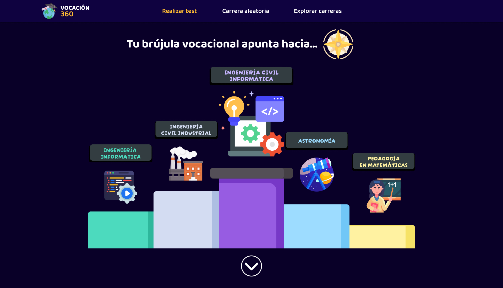

# Vocación360 UXD
User Experience Design for Vocación360: A Vocational Guidance Platform for High School Students in Chile

## Index

- [1. Introduction](#1-introduction)
  - [1.1. The Problem](#11-the-problem)
  - [1.2. Our Solution](#12-our-solution)
- [2. Team & Roles](#2-team--roles)
- [3. Strategy](#3-strategy)
  - [3.1. Value Proposition Canvas](#31-value-proposition-canvas)
  - [3.2. UX Personas](#32-ux-personas)
  - [3.3. Benchmarking](#33-benchmarking)
- [4. Scope](#4-scope)
  - [4.1 Customer Journey Map](#41-customer-journey-map)
    - [4.1.1 Decision Stage Interfaces](#411-decision-stage-interfaces)
- [5. Structure](#5-structure)
  - [5.1. Navigation Flow](#51-navigation-flow)
- [6. Skeleton](#6-skeleton)
  - [6.1. Low-Fi Wireframes](#62-low-fi-wireframes)
- [7. Surface](#7-surface)
  - [7.1. Interface Evolution](#71-interface-evolution)
  - [7.2. Results of the Heuristic Evaluation](#72-results-of-the-heuristic-evaluation)
  - [7.3. High Definition Interfaces](#73-high-definition-interfaces)

---

## 1. Introduction

### 1.1. **The Problem**

> What if I’m just wasting my time?  
> What if I disappoint my family with my decision?  
> Will I earn enough to make a living?

High school students in Chile face significant challenges when choosing their academic and professional paths. Existing vocational guidance platforms offer fragmented information across multiple websites, with overwhelming interfaces and technical language that create unnecessary barriers.

In a survey conducted with 40 students at Escuela Amanecer, **52.5%** stated that external opinions directly influence their vocational decisions, and **75%** said they are not aware of any online tools for academic program guidance. Platforms like *MiFuturo* or the Ministry of Education’s websites were not mentioned, revealing a lack of access to key information—and a strategic opportunity.

📊 You can view the full survey responses [here](https://docs.google.com/spreadsheets/d/18C8Lrk0pwEsjByS-7obqHJb23tWlxP_VGB2JUes502Y/edit?usp=sharing).

---

### 1.2. **Our Solution**

**Vocación360** addresses a complex issue across three dimensions: social, emotional, and technical—facing challenges due to the lack of reliable and accessible platforms.

#### 🟣 **Striking Aesthetic with a Strong Visual Identity**

- Color palette: **purples, oranges, and yellows**  
- A modern, immersive design that conveys **depth, energy, and modernity**

#### 🧭 **Adapted Vocational Guidance Test**

- **Two distinct paths:**  
  1. For students who feel **completely lost**  
  2. For those deciding between **two options**

- Realistic recommendations:  
  + *We won’t suggest Civil Engineering if you hate math!*

#### 🎲 **Gamified Degree Exploration**

- **Interactive die** that presents random degree programs  
- *Discover what you didn’t know you liked!*  
> [!NOTE]  
> It’s not about choosing at random, but broadening your perspective

#### 🔍 **Degree Explorer and Comparator**

- Filters by: **location, tuition cost, or average salary**  
- Visual cards with the most relevant information

---

## 2. Team & Roles

Camille Elgueta - Project Manager

Zihao Xiao - Analyst

Gerson Urrea - Designer

Carlos Pradenas - Presenter

---

## 3. Strategy

### 3.1. Value Proposition Canvas

*How we aligned student needs with our solution*

**Dual approach:**

1. **Students with clear options:** Exploration and comparison tools with up-to-date information.
2. **Lost or undecided students:** Vocational guidance test to narrow down options, plus a random degree explorer.

**Identified gaps:**

- **Social:** External pressure on decision-making.
- **Emotional:** Insecurity, fear of failure, or disappointing the family.
- **Technical:** Lack of attractive and integrated guidance platforms.

***

### 3.2. **UX Personas**  

*Defined through interviews and surveys with high school students, these personas reflect the diverse realities and needs behind Vocación360.*  

---

👥🔹 **Catalina González**  
*"I want to compare degree programs that balance my passions with real-world employability."*  

👥🔹 **Sofía Araya**  
*"I love art, but my family says it’s not a ‘serious degree program’."*  

👥🔹 **Jorge Muñoz**  
*"I need a degree program that lets me support my family quickly."*  

---

> *These personas guided key design decisions, such as removing technical jargon, adding a degree comparator, and prioritizing access without registration.*  

### 3.3. Benchmarking 

To develop an application that truly meets the needs and expectations of high school students seeking vocational guidance, it was essential to analyze existing platforms — including both direct competitors and indirect references known for good design and usability.

The goal was to identify the strengths and weaknesses of current solutions, both functionally and visually, in order to incorporate best practices and avoid common pitfalls.

#### Types of platforms analyzed:

- 🎓 **Direct competitor**: The platform *MiFuturo*, which provides educational program information.
- ⚖️ **Visual comparison tools**: Services like *QuePlan* or *ComparaOnline*, valued for their clarity and organization.
- 🖼️ **Aesthetic references**: Apps like *Airbnb*, known for their modern and minimalistic user experience.

---

## 4. Scope

### 4.1. Customer Journey Map

We identified four key stages in the user's interaction with Vocación360:

- 🔍 Awareness  
- 🤔 Consideration  
- ✅ Decision  
- 💬 Loyalty & Advocacy  

These stages reflect the complete journey — from first contact to long-term perception and potential recommendation.

#### 4.1.1. Decision Stage Interfaces

**Customer Activities**

The user explores key features of Vocación360 — comparing degree programs, discovering scholarships and benefits, and taking diagnostic tests. A key interface here is the academic program comparison screen, which lets users generate a downloadable table comparing two programs and their universities.

**Customer Goals**

The user’s goal is to identify the academic path that aligns best with their interests and abilities. To support this, Vocación360 offers interest, strengths, and skills tests. These identify the user’s strongest areas and provide a list of recommended programs at the end of each test. The results can be downloaded locally.

**Touchpoints**

The website interface is the primary point of contact with high school students. The home screen plays a key role, with a background in cool tones designed to inspire reflection and convey calm for students who may feel lost, anxious, or overwhelmed by the need to explore their true vocation and make decisions about their future.

---

## 5. Structure

### 5.1. Navigation Flow

The Vocación360 site map outlines a user-centered and streamlined structure designed to reduce friction and improve accessibility. Its key sections include:

- **Branched vocational guidance test**
- **Gamified random exploration of degree programs**
- **Degree program explorer with search functionality**
- **Visual degree program comparator**

> To maximize ease of access, the platform does **not require login or registration**, allowing students to explore all features freely without creating an account.

---

## 6. Skeleton

### 6.1. Low-fidelity wireframes

The wireframes developed represent an approximation of the structure and design of the interfaces associated with the committed functionalities. The main navigation between screens is carried out through a top navigation bar, which is present across all system interfaces.

In general terms, the interfaces can be grouped into three main thematic categories:

🧭 Interfaces Related to degree programs
These interfaces prioritize the use of tables to display structured and repetitive information, such as the characteristics and attributes of degree programs. Additionally, pie charts are used to present contextual information related to the composition of students enrolled in a program, as well as the academic weighting requirements needed to apply.

📝 Interfaces Related to Tests
These interfaces follow a minimalist and straightforward design, centered around Likert-scale questions that allow users to express degrees of agreement or disagreement. The test results are presented using pie charts that show the user's affinity with different areas of knowledge, along with a concise description and clear recommendations. The goal is to ensure that users can easily understand the results through precise and actionable information.

🎓 Interfaces Related to Student Benefits
The information is organized into three main sections. In each section, the benefits available to users are presented with a brief description and links to official platforms. A filter bar is included to allow students to explore the available benefits based on their interests. The main objective is for users to clearly identify what benefits they can access, their type, and where to go for more information.

- 📁 **[Wireframes Workspace – Vocación360 (Figma)](https://www.figma.com/design/xzcIdIPWxBuT59i8s7O3t0/Wireframes-Vocación360?t=7C1t74Ojj2hCTtnC-1)**  
  Complete set of low-fidelity wireframes in the shared Figma workspace

- 📄 **[Low-Fi Wireframes – Vocación360 (PDF)](docs/wireframes-vocacion360.pdf)**  
  Complete set of low-fidelity wireframes for all main interfaces
---

## 7. Surface

### 7.1. Interface Evolution

## Interface Evolution Process: Explanations and Key Reasons for Modifications

In the initial versions of the interface, we included a top navigation bar with the following options: Home, Undergraduate Programs, Benefits, Points of Interest, About Us, and Login/Register. However, as we refined the project's scope, we decided to remove "Points of Interest" and temporarily disregard the Login/Register functionality. This was because user login would only provide access to test history—something that we replaced by allowing users to download their results for free, without requiring registration. Nonetheless, we do not rule out including this feature in future versions.

Our second consideration was the target audience: high school students seeking vocational guidance. These young users are often confused or overwhelmed, and requesting them to create an account or enter personal information at the outset might discourage them from engaging further, so we chose to simplify access as much as possible.

Additionally, between the wireframes and the final prototype, we made adjustments to margins and spacing to better align with web design standards seen in similar informational websites. These changes improve readability and the overall browsing experience.

**Home Interface Evolution**

The original home wireframe offered options for taking tests, exploring programs, and searching scholarships. In the high-definition version, a minimalist design was adopted with fewer visible buttons and a calming forest background in blue and turquoise tones. The navigation bar became collapsible, featuring a subtle orange hover effect.

**Academic Program Interface Evolution**

The academic program view originally used side menus, but was redesigned with top navigation buttons for greater consistency across sections. In the specific section on weightings, a donut chart was added to visually display the percentage value of each PAES component.

**Interest Test Interface Evolution**

Initially, test questions showed their number and multiple-choice options, along with the total count in the center. In the updated version, a progress bar was added and a Likert scale was used, providing a clearer and more intuitive way to measure user interest.

**However, these represented the initial iterations of what would later become the final high-fidelity interfaces.**

***

#### Redesign of the navigable prototype

When presenting the first version, it was concluded that while the prototype’s functionalities were structurally sound, it failed to convey what a tool aimed at high school students truly should.

> *It did not address the students’ main fears. It overlooked the importance of visual design for a teenage audience, and most importantly, it lacked the soul that a prototype meant to guide one’s future should have.*

For this reason, a new iteration was carried out, resulting in the current version—one that not only redefined functionalities but also reimagined the prototype’s identity.

✅ **New purple-toned color palette:** Avoiding entirely blue tones, which can feel too formal, and reddish tones, which may undermine the tool’s seriousness.

✅ **Branched vocational orientation test:** The previous version had neglected what should have been *the essence of Vocación360*: the ability to guide students from diverse backgrounds. This version includes:

- Students who feel completely lost: *What are their interests? In which subjects do they perform well? Which ones do they avoid?*
- Students who have options but can’t decide: *The dilemma between what they want and what others expect. Also, what are their routines? Their priorities? How aligned are they with that option?*

✅ **Random search feature:** Aimed at opening students’ minds to paths they may have never considered, and helping them discover lesser-known fields within the country.

✅ **Exploration and comparison of options:** Because informed decisions also require concrete data and comparative analysis.

***

### 7.2. Results of the Heuristic Evaluation

A heuristic evaluation of *Vocación360* was conducted during its redesign phase, at a point where several features were still under development, such as the degree program comparator, test results, second test branching, and detailed degree program information. Despite this, the prototype already conveyed a clear visual identity. The evaluation yielded an average **SUS score of 68.75**, which we consider a promising result for the development stage.

However, several usability issues were identified and addressed before reaching the final version. The most relevant ones are detailed below:

---

| **Problem**                                                  | **Solution**                                                 |
| ------------------------------------------------------------ | ------------------------------------------------------------ |
| The top navigation bar did not indicate the user’s current section. Additionally, the test lacked clear progress segmentation. | The top nav bar was updated to highlight the current section in orange and underline items on hover. The test was divided into distinct progress stages. |

---

| **Problem**                                                  | **Solution**                                                 |
| ------------------------------------------------------------ | ------------------------------------------------------------ |
| The test interface did not indicate completion progress, which is common in similar platforms. | A progress bar was added to each test stage across both branches. |

---

| **Problem**                                                  | **Solution**                                                 |
| ------------------------------------------------------------ | ------------------------------------------------------------ |
| Low visual contrast in selected buttons and lack of options like "Skip" in questions. | Button contrast was improved using green/red tones to reflect ease/difficulty. A "Skip" option was added in the identity section. |

> [!IMPORTANT]  
> The "Skip" option was only added in the identity section. In other parts of the test, where questions are multiple choice and essential for orientation, it was intentionally excluded.

> [!NOTE]  
> A suggestion was made to change button colors based on subjects, but it was discarded to preserve the consistent purple-toned visual identity of the site.

---

| **Problem**                                                  | **Solution**                                                 |
| ------------------------------------------------------------ | ------------------------------------------------------------ |
| The main homepage image of a girl studying was not representative of the platform’s purpose and took up excessive space. | It was replaced with images of two students exploring their interests—reading and programming—and resized to better balance the layout. |

---

#### Additional heuristic-based improvements:

+ Footer section added.
+ Clear instructions on whether questions are single or multiple choice.
+ "Back" option included in each test stage.
+ Descriptive labels added to NavBar options.
+ References to official information sources included for data credibility.

***
### 7.3. High Definition Interfaces

High-fidelity interfaces clearly showcase the project's visual style, content structure, and navigation flow. Additionally, animations and transitions are incorporated where appropriate, delivering a more realistic and immersive user experience.

**Key highlights:**

- A **cool color palette** was chosen to convey a sense of calm, trust, and clarity throughout the user’s navigation.
- Since certain elements are repeated across multiple screens, a set of **reusable components** was created to ensure visual consistency and simplify maintenance. These components include the filter bar, search bar, navigation bar, buttons, and more.
- **Component variants** were designed to reflect different **visual states**, especially for interactive elements. For instance, buttons change color on hover, clearly indicating their interactivity and encouraging user engagement.

- 📁 **[Hi-Fi Interfaces Workspace – Vocación360 (Figma)](https://www.figma.com/design/Gxz3vWaPSxh9GKhD5ABmFu/Interfaces-Vocaci%C3%B3n360?t=7C1t74Ojj2hCTtnC-1)**  
  Final high-fidelity interface designs available in the shared Figma workspace

- 📄 **[Hi-Fi Interfaces – Vocación360 (PDF)](docs/hi-fi-interfaces-vocacion360.pdf)**  
  Final high-fidelity interface designs with visual style and interactions

---

## 8. Annex

This section provides direct access to all detailed PDF documents organized by project phase and section. Each document contains comprehensive information and visual materials supporting the design process.

### 3. Strategy Documents
- 📄 **[Value Proposition Canvas - Vocación360](docs/value-prop-canvas-vocacion360.pdf)**  
 Detailed analysis of user pains, gains, and our value proposition alignment
- 📄 **[UX Personas - Vocación360](docs/ux-personas-vocacion360.pdf)**  
 Complete user personas with detailed profiles, needs, and behaviors
- 📄 **[Benchmarking Analysis - Vocación360](docs/benchmarking-vocacion360.pdf)**  
 Comprehensive competitive analysis and market positioning

### 4. Scope Documents
- 📄 **[Customer Journey Map - Vocación360](docs/customer-journey-map-vocacion360.pdf)**  
 Detailed user journey mapping across all touchpoints and interactions

### 5. Structure Documents
- 📄 **[Sitemap - Vocación360](docs/sitemap-vocacion360.pdf)**  
 Complete information architecture and navigation structure

### 6. Skeleton Documents
- 📄 **[Low-Fi Wireframes - Vocación360](docs/wireframes-vocacion360.pdf)**  
 Complete set of low-fidelity wireframes for all main interfaces

### 7. Surface Documents
- 📄 **[Hi-Fi Interfaces - Vocación360](docs/hi-fi-interfaces-vocacion360.pdf)**  
 Final high-fidelity interface designs with visual style and interactions

---
